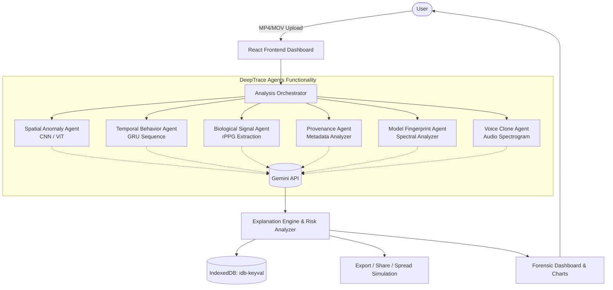

# DeepTrace - Agentic AI Deepfake Trust Analysis


DeepTrace is an elite, highly rigorous forensic AI system specialized in deepfake detection and generative model fingerprint attribution. It uses a multi-agent orchestrated approach powered by the Gemini 3 Flash Preview API to analyze video and audio across various dimensions, providing a comprehensive trust score and detailed forensic evidence.

## High-Level Architecture

DeepTrace is a strictly frontend application that orchestrates multiple simulated sub-agents through a central system using LLMCog/Gemini infrastructure.



## Features

- **Spatial Anomalies Agent**: Detects blending boundaries, mismatched lighting, unnatural skin textures, missing reflections, and asymmetrical facial features using CNN/ViT architectures.
- **Temporal Behavior Agent**: Analyzes frame-to-frame flickering, unnatural blinking, micro-expression inconsistencies, and lip-sync desynchronization using GRU sequences.
- **Biological Signal Agent**: Extract and analyze micro-color changes in the skin (pulse/rPPG) to detect unnatural vital signs.
- **Provenance & Lineage Agent**: Inspects metadata inconsistencies, missing EXIF data, compression matrices, and traces of generative AI software.
- **Model Fingerprint Agent**: Identifies the generative signature (e.g., GAN, Diffusion) based on visual artifact structures and frequency-domain patterns.
- **Voice Clone Agent**: Analyzes audio for unnatural pitch, mel spectrogram artifacts, repeated waveform patterns, and lack of natural breath noise.

## Tech Stack

- **Frontend Core**: React 19, TypeScript, Vite
- **Styling & Animation**: Tailwind CSS v4, Motion (Framer), Lucide React Icons
- **Data Visualization**: Recharts
- **AI Integrations**: `@google/genai` (Gemini API)
- **Local Storage**: `idb-keyval` (IndexedDB caching)
- **Exporting Tools**: `jspdf`, `html-to-image`

## Getting Started

1. **Install dependencies:**
   ```bash
   npm install
   ```
2. **Setup environment variables:**
   You have the option of either providing the `GEMINI_API_KEY` in the application Settings (Dashboard UI) or adding it via `.env`:
   ```env
   GEMINI_API_KEY=your_gemini_api_key_here
   ```
3. **Start the development server:**
   ```bash
   npm run dev
   ```
   The site will be running at `http://localhost:3000` (or another port if 3000 is occupied).

## Demo & Usage

1. Open the application.
2. In the **Dashboard** tab, enter your custom Gemini API key if you haven't set it via environment variables.
3. Click the upload area to drop your video file (MP4, MOV, AVI — max 200MB).
4. Watch the progress loader while the multi-agent system runs inference.
5. Review the **Authenticity Conclusion**, **Trust Score**, and visual heatmaps.
6. Switch to the **Forensics** tab to read deep metric-by-metric breakdowns.
7. Click the **Export Report (PDF)** to generate a final attribution report.
